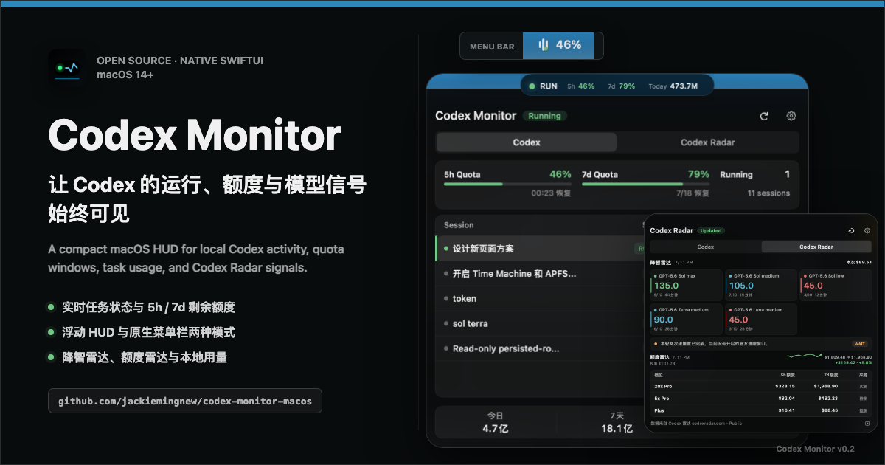
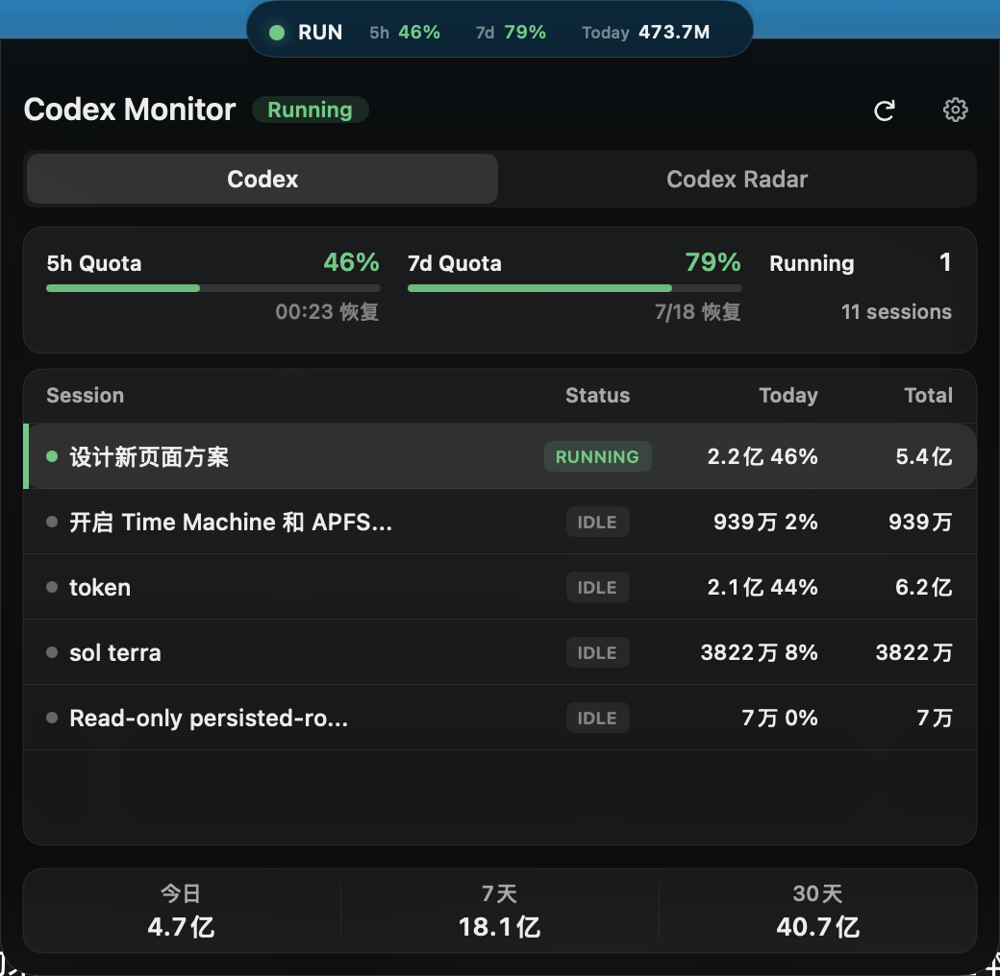
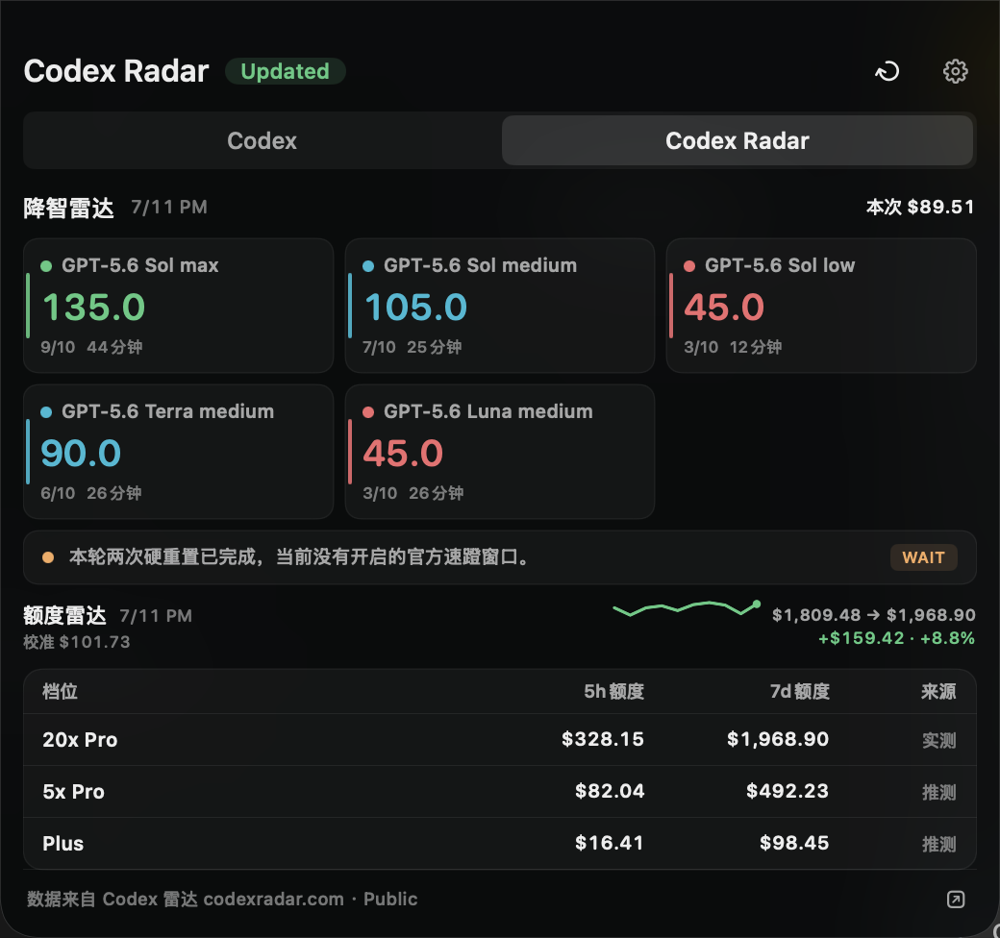
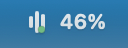

# codex监测 / Codex Monitor

[](https://github.com/jackiemingnew/codex-monitor-macos/actions/workflows/clean-package.yml)

<p align="center">
  
</p>

<p>
  <a href="#中文">中文</a> |
  <a href="#english">English</a>
</p>

## 功能示意 / Screenshots

<p align="center">
  
  
</p>
<p align="center">
  <sub>浮动 HUD 与 Codex 详情 / Floating HUD and Codex details · Codex Radar</sub>
</p>
<p align="center">
  
</p>
<p align="center">
  <sub>菜单栏紧凑模式只突出当前 5 小时剩余额度 / Compact menu bar mode prioritizes the current 5-hour quota</sub>
</p>

<a id="中文"></a>

## 中文

codex监测是一款原生 macOS 刘海屏监测工具。它会贴合 MacBook 刘海区域，在左右两侧显示 Codex 本地运行状态、剩余额度或远程面板状态，并可以展开成类似灵动岛的详情面板。

项目当前支持本机 Codex、Codex Radar、CLIProxyAPI / CPA Manager Plus、NewAPI 和 Sub2API 多类数据源，适合需要长期观察 Codex 使用量、账号额度、模型动态和远程代理面板状态的用户。

### 功能概览

- 刘海区域常驻显示：左侧状态灯，右侧关键指标。
- 支持两种顶部模式：默认浮动 HUD，或融入 macOS 右侧菜单栏、仅突出 5 小时剩余额度的紧凑状态项。
- 点击刘海区域展开详情面板，再次点击外部区域可收起。
- 顶部 HUD 可水平拖动并记住位置；右键可返回主屏默认中心位置。
- 详情页使用多 tab 模式：`Codex`、`Codex Radar`、`CLIProxyAPI`、`NewAPI`、`Sub2API`。
- 支持手动选择刘海区域显示来源，也支持自动模式优先展示有提醒的外部监控。
- 支持设置页独立开关每一种监控源。
- 支持刷新按钮、设置按钮、右键菜单、开机自启和运行指示灯动画。

### 本机 Codex 监测

本机 Codex 页面用于监测当前 Mac 上安装并运行的 Codex。

可显示：

- Codex 是否正在执行任务。
- 5 小时和 7 天额度剩余百分比。
- 正在运行和最近活动的对话列表。
- 当前活跃任务的活跃子代理数量。
- 每个父对话自身的 token 用量；子代理 token 不会并入父对话。
- 今日、7 天、30 天 token 用量统计。

本机数据主要来自当前用户目录下的 Codex 数据文件，例如：

- `~/.codex/state_5.sqlite`
- `~/.codex/logs_2.sqlite`
- `~/.codex/sessions`
- 最近的 rollout JSONL 文件

应用只读取这些文件，不会修改 Codex 的本地数据。

### Codex Radar

Codex Radar 页面用于展示 codexradar.com 提供的模型动态和额度雷达摘要。

可显示：

- 最新模型评分和对比摘要。
- 动态识别当前模型系列与推理档位，包括 5.6 Sol / Terra / Luna 以及未来新增模型。
- 公开 summary 或授权 API 返回的额度雷达数据。
- 数据更新时间、来源和 codexradar.com 归因链接。

Codex Radar 默认读取 `https://codexradar.com/current.json` 公开 summary，不访问 Keychain。在设置中主动开启“使用授权 API”后，应用才会读取统一凭证库中的 token 并访问 `https://codexradar.com/api/v1/current`；token 无效或 API 暂不可用时会明确提示并降级到公开 summary。Radar token 与其他凭证一起保存在设置中选择的统一凭证库；`CODEXRADAR_API_TOKEN` 仍作为当前进程的临时最高优先级覆盖。旧版 Application Support token 文件只会在用户启用授权 API、完成交互式加载并验证写入后删除。

### CLIProxyAPI / CPA Manager Plus 监测

远程 Codex 账号监测支持两种数据来源：

- `CLIProxyAPI`：直接读取 CLIProxyAPI 管理接口中的 Codex auth 文件和账号状态。
- `CPA Manager Plus`：读取 CPA Manager Plus 的服务端巡检结果和用量统计。

如果你的服务端已经部署 CPA Manager Plus，建议优先选择 CPA Manager Plus。它可以复用服务端定时巡检结果，避免客户端重复触发账号检查。

远程页面可显示：

- 已启用 Codex 账号列表。
- 账号正常、配额耗尽、异常数量。
- 每个账号的套餐、索引、成功/失败次数。
- Codex 账号 5h / 7d 剩余额度。
- 账号异常原因，例如登录过期、账号不可用、请求失败、5 小时额度已满、周额度已满等。
- CPA Manager Plus 的 24 小时、7 天、30 天总 token 用量。

### NewAPI 和 Sub2API 余额监测

NewAPI 和 Sub2API 用于监测普通用户账号余额，而不是管理员侧的全局面板状态。

支持：

- 多账号管理。
- 每个账号单独配置面板地址、用户名、密码、请求超时和 TLS 行为。
- 默认余额阈值，也可为单个账号配置自定义阈值。
- 提醒阈值和告警阈值两级状态。
- 余额低于提醒阈值时显示黄色提醒。
- 余额低于告警阈值时显示红色告警。
- 展示账户余额、已用余额、已用 token、请求次数等面板返回的数据。
- 多币种或不同计价单位会分组汇总，无法安全相加时会显示为多币种摘要。

认证方式：

- NewAPI 使用 `POST /api/user/login` 登录，再读取用户信息。
- Sub2API 使用 `POST /api/v1/auth/login` 登录，再读取用户资料和平台额度。

### 设置

设置窗口分为以下页面：

- `Codex`：本机 Codex 刷新频率、额度来源、任务范围和历史用量显示。
- `Codex Radar`：Codex Radar 开关、API token、手动刷新和数据源状态。
- `CLIProxyAPI`：远程 Codex 数据源、面板地址、管理密钥、刷新频率、请求超时和 TLS 设置。
- `NewAPI`：NewAPI 监测开关、刷新频率、默认阈值和账号列表。
- `Sub2API`：Sub2API 监测开关、刷新频率、默认阈值和账号列表。
- `启动与外观`：浮动 HUD / 菜单栏模式、顶部显示来源、密钥存储方式、开机自启和指示灯动画。
- `关于`：软件简介、当前版本号和监测能力说明。

设置页中的问号按钮会解释每个配置项的作用。大部分远程配置只有在点击“保存”后才会生效，避免输入密码或密钥时立即触发请求。

### 密钥存储

应用支持两种密钥存储方式：

- `钥匙串`：默认方式，安全性更高。由于当前应用是本地 ad-hoc 签名，更新应用后 macOS 可能会重新请求访问授权。
- `本机数据库`：保存在 `~/Library/Application Support/codex监测/secrets.sqlite3`，文件权限限制为当前用户可读写。它可以减少钥匙串授权弹窗，但安全性低于钥匙串。

切换存储方式时，应用会把当前已保存的密钥迁移到新的存储位置。请不要把本机数据库文件提交到 GitHub 或分享给他人。

### 构建和运行

要求：

- macOS 14 或更高版本。
- Swift 6 toolchain / Xcode Command Line Tools。

直接运行：

```bash
swift run CodexNotch
```

构建 release：

```bash
swift build -c release
```

构建可双击运行的 `.app` 和 `.dmg`：

```bash
./scripts/build-app.sh
```

DMG 会输出到 `dist/`，文件名包含软件名、版本号和支持架构，例如：

```text
dist/codex-monitor-0.2.0-arm64.dmg
dist/codex-monitor-0.2.0-amd64.dmg
```

版本号唯一读取自仓库根目录的 `VERSION`；`Info.plist`、DMG 文件名和 Release tag 必须保持一致。

安装到当前用户的 Applications 目录：

```bash
./scripts/install-user-app.sh
```

安装脚本会复制到：

```text
~/Applications/codex监测.app
```

因此本机更新通常不需要管理员密码。

### 干净环境验证

仓库使用 GitHub-hosted `macos-15` runner，在全新 checkout 中运行回归测试、构建 arm64 / x86_64 双架构 DMG，并验证 Info.plist、ad-hoc 签名、DMG 内二进制架构和空 Codex home JSON 快照。CI 不读取开发机上的 `.codex`、ChatGPT.app、token 或构建缓存。

在任意安装了 Swift 6 和 Xcode Command Line Tools 的 Mac 上，可以用一条命令从公开仓库重新拉取并执行同一套检查：

```bash
./scripts/verify-clean-clone.sh
```

可选参数为仓库地址和分支：

```bash
./scripts/verify-clean-clone.sh \
  https://github.com/jackiemingnew/codex-monitor-macos.git \
  main
```

验证后的 DMG 和 `SHA256SUMS` 会复制到当前目录下的 `clean-package-artifacts/<commit>/`。设置 `KEEP_CLEAN_CLONE=1` 可以保留临时 checkout，设置 `CLEAN_PACKAGE_OUTPUT_DIR` 可以更改产物目录。

GitHub Actions 中的 DMG 使用 ad-hoc 签名，未经过 Apple notarization，只作为可复现构建与测试产物，不等同于正式签名 Release。

### 正式 Release

`.github/workflows/release.yml` 只在推送 `v*` tag 时运行。它会强制校验 tag 与 `VERSION` 一致，导入临时 Developer ID keychain，完成双架构构建、Hardened Runtime 签名、Apple notarization、ticket stapling 和 Gatekeeper 验证，最后创建 GitHub Release 并上传两个 DMG 与 `SHA256SUMS`。Apple 的流程要求见[官方 notarization 文档](https://developer.apple.com/documentation/security/notarizing-macos-software-before-distribution)。

需要先在 GitHub Actions Secrets 配置：

- `DEVELOPER_ID_CERTIFICATE_BASE64`：Developer ID Application `.p12` 的 Base64 内容。
- `DEVELOPER_ID_CERTIFICATE_PASSWORD`：`.p12` 密码。
- `APPLE_API_PRIVATE_KEY_BASE64`：App Store Connect API `.p8` 私钥的 Base64 内容。
- `APPLE_API_KEY_ID`：App Store Connect API Key ID。
- `APPLE_API_ISSUER_ID`：Team API Key 的 Issuer ID；Individual API Key 可留空。

凭证不会写入仓库或 Release artifact。确认 `main` 的 `Clean macOS package / verify` 通过后，再创建版本 tag：

```bash
git switch main
git pull --ff-only
git tag -a v0.2.0 -m "Codex Monitor v0.2.0"
git push origin v0.2.0
```

不要在签名 secrets 未配置时推送正式 tag；Release workflow 会拒绝缺少凭证的发布。

### 调试命令

打印完整本机快照：

```bash
.build/release/CodexNotch --print-snapshot
```

该输出是人类可读格式，`task=` 行保持兼容：最后一列仍为 token 数。

兼容的人类可读快照别名（当前与完整快照语义一致，不保证更快）：

```bash
.build/release/CodexNotch --print-fast-snapshot
```

打印稳定 JSON 快照，包含每个任务的 `subagents` 活跃子代理数量：

```bash
.build/release/CodexNotch --print-snapshot-json
```

兼容的 JSON 快照别名（当前与完整快照语义一致，不保证更快）：

```bash
.build/release/CodexNotch --print-fast-snapshot-json
```

打印最近 200 条额度决策日志：

```bash
.build/release/CodexNotch --print-diagnostics --limit 200
```

结构化日志保存在 `~/Library/Logs/CodexMonitor/quota-diagnostics.jsonl`，
只记录额度、reset、来源和选择原因，不记录任务内容、账号或凭证。字段说明见
[`docs/DIAGNOSTICS.md`](docs/DIAGNOSTICS.md)。

运行回归测试：

```bash
./scripts/run-regression-tests.sh
```

### 注意事项

- 本项目当前面向 MacBook 刘海屏设计。在无刘海屏或外接显示器上也可以运行，但视觉位置可能需要按实际设备调整。
- 本机 Codex 的额度和任务状态依赖 Codex 本地数据文件。如果 Codex 改变文件结构，可能需要同步适配。
- Codex Radar token 只用于读取 codexradar.com 授权 API，并随统一凭证库的 Keychain/本机数据库模式迁移。请不要把旧版 token 文件、环境变量值或设置截图提交到公开仓库。
- CPA Manager Plus 模式读取的是服务端巡检结果。服务端巡检频率由 CPA Manager Plus 自身配置决定，客户端刷新只是读取最新结果。
- `固定自签名证书` 仅在配置 origin 与服务器叶证书 SHA-256 指纹同时匹配时连接；跨源或 HTTPS→HTTP 重定向会被拒绝。
- 本地构建默认使用 ad-hoc 签名，适合本机验证；正式 tag Release 强制使用 Developer ID、Hardened Runtime 和 Apple notarization。
- 请不要把任何真实面板地址、管理密钥、账号密码或本机密钥数据库提交到公开仓库。

### 项目结构

```text
Sources/CodexNotch/              应用源码
Tests/CodexNotchRegressionTests/ 回归测试
VERSION                         版本号唯一真源
scripts/build-app.sh             构建 .app 和 .dmg
scripts/install-user-app.sh      安装到 ~/Applications
scripts/notarize-release.sh      notarize、staple 并验证正式 DMG
scripts/run-regression-tests.sh  运行回归测试
scripts/clean-dev-artifacts.sh   清理 .build 和 dist 开发产物
.github/workflows/release.yml    tag 驱动的正式 Release
```

### 许可证

本项目使用 MIT License，详见 `LICENSE`。

本项目基于 [ALight777/codex-monitor](https://github.com/ALight777/codex-monitor)
的早期实现继续开发。新独立仓库保留原始提交历史和作者归因；后续功能、视觉系统与维护由 Jackie Liu 及项目贡献者推进。更多来源说明见 `NOTICE.md`。

### 视觉系统

项目自带 `DESIGN.md` 作为 Codex Monitor 的视觉系统说明。它参考公开设计系统分析提炼方向，但视觉身份、token 和实现约束均为本项目自有。

<a id="english"></a>

## English

Codex Monitor is a native macOS notch overlay for monitoring Codex activity, local usage, and several remote account panels. It sits around the MacBook notch like a compact dynamic island, showing a small status indicator on the left and key metrics on the right.

The app currently supports local Codex telemetry, Codex Radar, CLIProxyAPI / CPA Manager Plus, NewAPI, and Sub2API. It is designed for users who want a persistent, low-friction view of Codex activity, quota status, model signals, and remote account balances.

### Features

- Persistent notch overlay with left-side status and right-side metrics.
- Two top-bar modes: the existing floating HUD by default, or a compact native macOS menu-bar item focused on the remaining 5-hour quota.
- Click to expand a dynamic-island-style detail panel.
- Drag the HUD horizontally to keep its position across launches; use the context menu to return it to the primary-screen center.
- Multi-tab detail panel: `Codex`, `Codex Radar`, `CLIProxyAPI`, `NewAPI`, and `Sub2API`.
- Per-source enable/disable switches.
- Manual or automatic notch display source selection.
- Manual refresh buttons, settings button, context menu, launch at login, and optional pulse animation.

### Local Codex Monitoring

The Codex tab monitors the Codex installation on the current Mac.

It can show:

- Whether Codex is currently running a task.
- Remaining 5-hour and 7-day quota percentages.
- Running and recent conversations.
- Active subagent count for currently running tasks.
- Token usage for each parent conversation; subagent tokens are not folded into the parent total.
- Today, 7-day, and 30-day token usage totals.

Local data is read from Codex files under the current user account, including:

- `~/.codex/state_5.sqlite`
- `~/.codex/logs_2.sqlite`
- `~/.codex/sessions`
- recent rollout JSONL files

The app reads these files only. It does not modify local Codex data.

### Codex Radar

The Codex Radar tab shows model signals and quota radar summaries from codexradar.com.

It can show:

- Latest model scores and comparison summaries.
- Dynamic model-family and reasoning-tier discovery, including 5.6 Sol / Terra / Luna and future additions.
- Quota radar data from the public summary or authorized API.
- Update timestamps, data source, and codexradar.com attribution link.

Codex Radar defaults to the public summary at `https://codexradar.com/current.json` and does not read Keychain. It reads the unified-vault token and calls `https://codexradar.com/api/v1/current` only after the user explicitly enables **Use authorized API** in Settings; invalid tokens and temporary API failures are reported before falling back to the public summary. `CODEXRADAR_API_TOKEN` remains a process-only highest-priority override. The legacy Application Support token file is migrated and removed only after authorized API mode is enabled and an interactive vault write is verified.

### CLIProxyAPI / CPA Manager Plus Monitoring

Remote Codex account monitoring supports two data sources:

- `CLIProxyAPI`: reads Codex auth files and account status directly from the CLIProxyAPI management API.
- `CPA Manager Plus`: reads server-side inspection results and usage analytics from CPA Manager Plus.

If CPA Manager Plus is available, it is the recommended source because the app can reuse server-side inspection results instead of repeatedly checking every account from the client.

The remote tab can show:

- Enabled Codex accounts.
- Healthy, quota-exhausted, and abnormal account counts.
- Plan, account index, success count, and failure count.
- 5h / 7d remaining quota for each Codex account.
- Clear status reasons such as expired login, unavailable account, request failures, 5-hour quota exhausted, and weekly quota exhausted.
- CPA Manager Plus total token usage for 24 hours, 7 days, and 30 days.

### NewAPI and Sub2API Balance Monitoring

NewAPI and Sub2API monitoring is intended for normal user accounts, not global administrator dashboards.

Supported capabilities:

- Multiple accounts per source.
- Per-account panel URL, username, password, timeout, and TLS behavior.
- Default balance thresholds with optional per-account custom thresholds.
- Two-level threshold status: warning and alert.
- Yellow warning when the balance falls below the warning threshold.
- Red alert when the balance falls below the alert threshold.
- Balance, used amount, used tokens, request count, and other supported panel fields.
- Multi-currency or mixed-unit summaries are grouped instead of being incorrectly added together.

Authentication:

- NewAPI uses `POST /api/user/login`, then reads user information.
- Sub2API uses `POST /api/v1/auth/login`, then reads user profile and platform quota data.

### Settings

The settings window is split into these tabs:

- `Codex`: local refresh intervals, quota source, task range, and period usage display.
- `Codex Radar`: Codex Radar enable switch, API token, manual refresh, and data source status.
- `CLIProxyAPI`: remote Codex source, panel URL, management key, refresh interval, timeout, and TLS settings.
- `NewAPI`: NewAPI monitoring, refresh interval, default thresholds, and account list.
- `Sub2API`: Sub2API monitoring, refresh interval, default thresholds, and account list.
- `Launch & Appearance`: floating HUD / menu-bar mode, top display source, secret storage mode, launch at login, and pulse animation.
- `About`: app summary, current version, and supported monitoring sources.

Question-mark buttons next to setting labels explain what each option does. Most remote settings take effect only after clicking Save, so typing passwords or keys does not immediately trigger network requests.

### Secret Storage

The app supports two secret storage modes:

- `Keychain`: the default and more secure option. Because the app is currently ad-hoc signed, macOS may ask for Keychain access again after app updates.
- `Local database`: stores secrets in `~/Library/Application Support/codex监测/secrets.sqlite3` with current-user-only file permissions. This reduces Keychain prompts, but is less secure than Keychain.

When switching storage modes, the app migrates currently saved secrets into the selected store. Do not commit or share the local secret database.

### Build and Run

Requirements:

- macOS 14 or later.
- Swift 6 toolchain / Xcode Command Line Tools.

Run directly:

```bash
swift run CodexNotch
```

Build release binary:

```bash
swift build -c release
```

Build a double-clickable `.app` and `.dmg`:

```bash
./scripts/build-app.sh
```

The DMG is written to `dist/` with the app name, version, and supported architecture in the filename, for example:

```text
dist/codex-monitor-0.2.0-arm64.dmg
dist/codex-monitor-0.2.0-amd64.dmg
```

The repository-root `VERSION` file is the single version source. `Info.plist`, DMG filenames, and the Release tag must agree.

Install into the current user's Applications folder:

```bash
./scripts/install-user-app.sh
```

The install script copies the app to:

```text
~/Applications/codex监测.app
```

Local updates usually do not require an administrator password.

### Clean-Room Verification

The repository uses a GitHub-hosted `macos-15` runner to run regression tests in a fresh checkout, build separate arm64 and x86_64 DMGs, and verify Info.plist metadata, ad-hoc signatures, packaged binary architectures, and an empty-Codex-home JSON snapshot. CI does not read a developer machine's `.codex` data, ChatGPT.app installation, tokens, or build caches.

On any Mac with Swift 6 and Xcode Command Line Tools, run the same checks from a newly cloned public repository with one command:

```bash
./scripts/verify-clean-clone.sh
```

The optional arguments are the repository URL and ref:

```bash
./scripts/verify-clean-clone.sh \
  https://github.com/jackiemingnew/codex-monitor-macos.git \
  main
```

Validated DMGs and `SHA256SUMS` are copied to `clean-package-artifacts/<commit>/` under the current directory. Set `KEEP_CLEAN_CLONE=1` to retain the temporary checkout or `CLEAN_PACKAGE_OUTPUT_DIR` to choose another artifact directory.

DMGs produced by GitHub Actions use ad-hoc signing and are not Apple-notarized. They are reproducible build/test artifacts, not official signed releases.

### Official Releases

`.github/workflows/release.yml` runs only for pushed `v*` tags. It requires the tag to match `VERSION`, imports a temporary Developer ID keychain, performs the dual-architecture build, Hardened Runtime signing, Apple notarization, ticket stapling, and Gatekeeper assessment, then creates a GitHub Release containing both DMGs and `SHA256SUMS`. See [Apple's notarization documentation](https://developer.apple.com/documentation/security/notarizing-macos-software-before-distribution) for the underlying requirements.

Configure these GitHub Actions secrets first:

- `DEVELOPER_ID_CERTIFICATE_BASE64`: Base64-encoded Developer ID Application `.p12`.
- `DEVELOPER_ID_CERTIFICATE_PASSWORD`: password for the `.p12`.
- `APPLE_API_PRIVATE_KEY_BASE64`: Base64-encoded App Store Connect API `.p8` private key.
- `APPLE_API_KEY_ID`: App Store Connect API Key ID.
- `APPLE_API_ISSUER_ID`: Issuer ID for a Team API Key; leave empty for an Individual API Key.

Credentials are never written to the repository or Release artifacts. After `Clean macOS package / verify` passes on `main`, create the version tag:

```bash
git switch main
git pull --ff-only
git tag -a v0.2.0 -m "Codex Monitor v0.2.0"
git push origin v0.2.0
```

Do not push an official tag before the signing secrets are configured. The Release workflow intentionally fails rather than publishing an unsigned fallback.

### Debug Commands

Print a full local snapshot:

```bash
.build/release/CodexNotch --print-snapshot
```

This is human-readable output. For compatibility, `task=` lines still end with the token count.

Compatibility alias for the human-readable snapshot (currently the same semantics as the full snapshot and not guaranteed to be faster):

```bash
.build/release/CodexNotch --print-fast-snapshot
```

Print a stable JSON snapshot, including each task's `subagents` active subagent count:

```bash
.build/release/CodexNotch --print-snapshot-json
```

Compatibility alias for the JSON snapshot (currently the same semantics as the full snapshot and not guaranteed to be faster):

```bash
.build/release/CodexNotch --print-fast-snapshot-json
```

Print the latest 200 quota-resolution diagnostics:

```bash
.build/release/CodexNotch --print-diagnostics --limit 200
```

Structured logs are stored at `~/Library/Logs/CodexMonitor/quota-diagnostics.jsonl`.
They contain quota values, reset timestamps, sources, and decision reasons, but
never task content, account details, or credentials. See
[`docs/DIAGNOSTICS.md`](docs/DIAGNOSTICS.md) for the schema.

Run regression tests:

```bash
./scripts/run-regression-tests.sh
```

### Notes

- The UI is designed for MacBook displays with a physical notch. It can run on external or non-notched displays, but visual positioning may need adjustment.
- Local Codex monitoring depends on Codex's local data files. If Codex changes its file format, the app may need an update.
- Codex Radar tokens are used only for the codexradar.com authorized API and migrate with the unified Keychain/local-database vault. Do not commit legacy token files, environment variable values, or settings screenshots to a public repository.
- CPA Manager Plus mode reads server-side inspection results. The inspection frequency is controlled by CPA Manager Plus, while this app only controls how often it reads the latest result.
- `Pin self-signed certificate` requires both the configured origin and the leaf-certificate SHA-256 fingerprint to match; cross-origin and HTTPS-to-HTTP redirects are rejected.
- Local builds use ad-hoc signing by default. Official tag releases require Developer ID, Hardened Runtime, and Apple notarization.
- Never commit real panel URLs, management keys, account passwords, or local secret database files to a public repository.

### Repository Layout

```text
Sources/CodexNotch/              App source
Tests/CodexNotchRegressionTests/ Regression tests
VERSION                         Single source for the app version
scripts/build-app.sh             Build .app and .dmg
scripts/install-user-app.sh      Install to ~/Applications
scripts/notarize-release.sh      Notarize, staple, and verify release DMGs
scripts/run-regression-tests.sh  Run regression tests
scripts/clean-dev-artifacts.sh   Remove .build and dist development artifacts
.github/workflows/release.yml    Tag-driven official Release
```

### License

This project is licensed under the MIT License. See `LICENSE` for details.

This project continues the early work from
[ALight777/codex-monitor](https://github.com/ALight777/codex-monitor). The new
standalone repository preserves the original commit history and authorship;
subsequent features, visual-system work, and maintenance are led by Jackie Liu
and project contributors. See `NOTICE.md` for provenance details.

### Visual System

This repository includes `DESIGN.md` as the Codex Monitor visual system. It uses public design-system analyses as directional references, while keeping this project's visual identity, tokens, and implementation rules independent.
